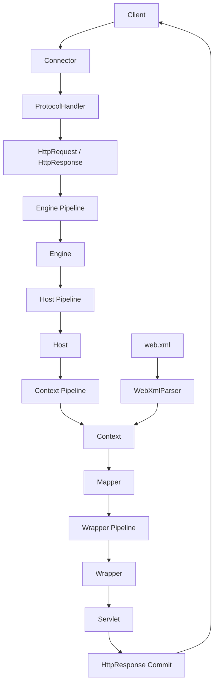
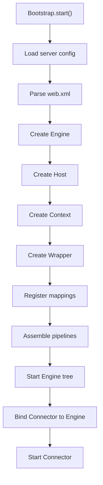
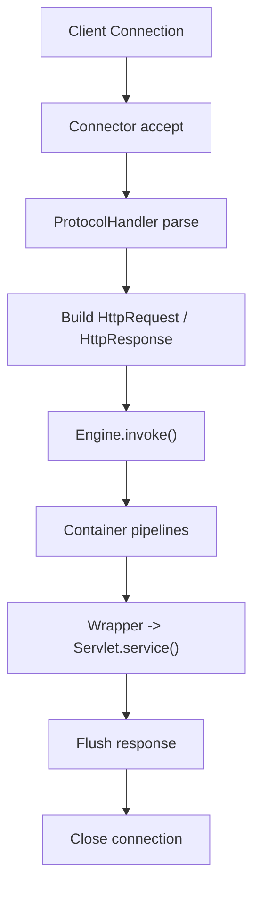
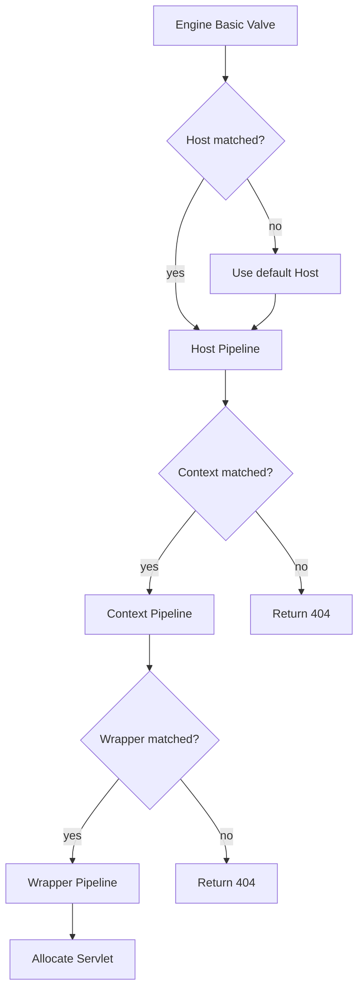
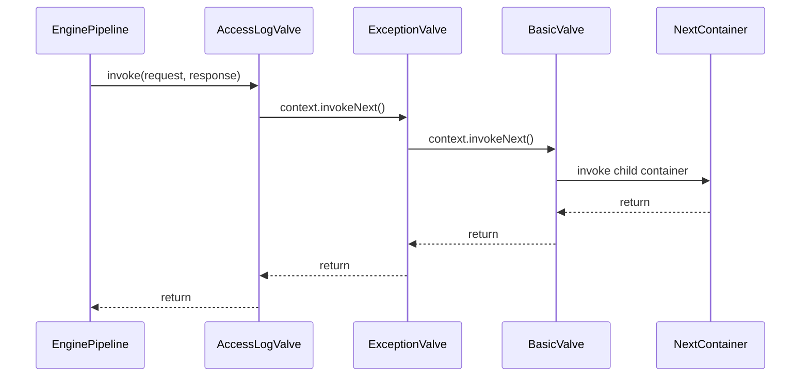
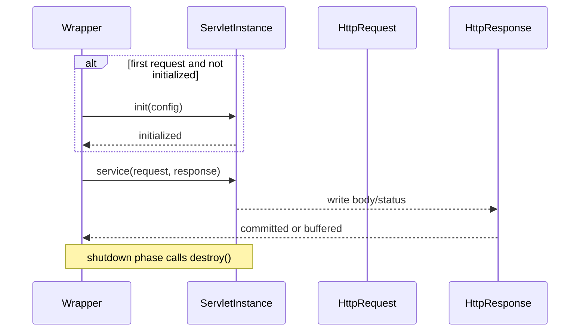

# 1. 背景与目标

## 1.1 为什么做 mini-tomcat

mini-tomcat 的目标是抽取 Apache Tomcat 在 Servlet 请求处理链路中的最小可用子集，构建一个仅面向学习与验证的轻量 Web 容器设计。该设计只覆盖一次 HTTP 请求从接入、路由、执行到响应返回的闭环，不扩展到 JSP、完整规范兼容、复杂运维能力或高性能网络优化。

该设计适合作为 `mini-springmvc` 的运行时容器基础，但本文只定义容器内核，不设计 MVC、IoC、AOP 或注解扫描框架。

## 1.2 与 Tomcat 的对齐范围

- 对齐目标：Connector、Container 分层、Pipeline/Valve、Servlet 生命周期、`web.xml` 部署、最小 URL 映射。
- 对齐方式：抽象职责和执行模型与 Tomcat 等价，接口与实现规模压缩到可落地的最小子集。
- 不对齐项：JSP、EL、完整 Servlet 规范、APR、HTTP/2、TLS、JMX、复杂热部署、生产级连接优化。

## 1.3 术语表

| 术语 | 定义 |
| --- | --- |
| Connector | 接入层抽象，负责接收连接、解析 HTTP 请求、封装 Request/Response、将请求交给顶层 Container。 |
| Container | 容器层抽象，负责按层级组织请求路由与组件生命周期。 |
| Engine | 顶层容器，代表整个 Servlet 引擎入口，负责按 Host 名称分发。 |
| Host | 虚拟主机容器，负责按站点名管理多个 Context。 |
| Context | Web 应用容器，负责维护部署单元、Servlet 注册表、URL 映射与应用级生命周期。 |
| Wrapper | Servlet 包装容器，负责持有单个 Servlet 定义并完成实例生命周期编排。 |
| Pipeline | 容器内部责任链载体，按顺序执行多个 Valve。 |
| Valve | 单个处理节点，可进行校验、路由、异常转换、最终调用下一级容器。 |
| Mapper | 映射组件，负责 Host、Context、Servlet 三层映射决策。 |
| Servlet | 业务处理抽象，暴露 `init/service/destroy` 生命周期。 |

## 1.4 com.xujn 包结构建议

```text
com.xujn.minitomcat
├── bootstrap
│   ├── Bootstrap
│   ├── Lifecycle
│   └── LifecycleState
├── connector
│   ├── Connector
│   ├── ProtocolHandler
│   ├── HttpRequest
│   ├── HttpResponse
│   └── bio
├── container
│   ├── Container
│   ├── ContainerBase
│   ├── Engine
│   ├── Host
│   ├── Context
│   ├── Wrapper
│   └── standard
├── pipeline
│   ├── Pipeline
│   ├── Valve
│   ├── ValveContext
│   └── standard
├── mapper
│   ├── Mapper
│   ├── MappingResult
│   └── MappingRegistry
├── servlet
│   ├── Servlet
│   ├── ServletConfig
│   ├── ServletContext
│   └── ServletException
├── deploy
│   ├── WebXmlParser
│   ├── WebAppDefinition
│   ├── ServletDefinition
│   ├── ServerDefinition
│   └── DeploymentException
├── support
│   ├── exception
│   ├── http
│   └── thread
└── session
```

# 2. Tomcat 核心能力抽取（最小闭环）

## 2.1 能力清单

| 能力 | 级别 | 说明 |
| --- | --- | --- |
| Connector 接入层抽象 | 必须 | 接收 HTTP 请求并转交 Engine。 |
| Container 分层模型 | 必须 | Engine/Host/Context/Wrapper 组件树。 |
| Pipeline/Valve 责任链 | 必须 | 容器内部可插拔处理链。 |
| Servlet 生命周期 | 必须 | `init/service/destroy` 最小闭环。 |
| URL 映射 | 必须 | `web.xml` 驱动的 URL 到 Wrapper 路由。 |
| 统一异常与响应提交规则 | 必须 | 404、500、已提交响应的处理边界。 |
| 简单线程池策略描述 | 必须 | 作为 Connector 的并发处理策略。 |
| Session | 可选 | Phase 3 增量能力，默认关闭。 |
| ClassLoader 隔离 | 可选 | Phase 3 增量能力，默认关闭。 |
| 注解部署 | 可选 | 作为 `web.xml` 的增强路径。 |
| JSP/EL | 不做 | 超出最小 Servlet 容器范围。 |
| 高级 NIO/HTTP2/TLS | 不做 | 仅保留接入层抽象。 |
| 热部署/JMX/管理后台 | 不做 | 不进入当前最小闭环。 |

## 2.2 Connector 接入层抽象

- 定义：屏蔽网络接入差异，将连接处理、HTTP 解析与容器调用解耦。
- 价值：使 IO 模型与容器层分离，便于从 `SIMPLE_BIO` 演进到 `SIMPLE_NIO`。
- 最小闭环：监听端口 -> 接收请求 -> 解析请求行/请求头/请求体 -> 构造 Request/Response -> 调用 Engine。
- 依赖关系：依赖 `ProtocolHandler`、`Engine`、线程执行策略、Request/Response 抽象。
- 边界：
  - 支持：HTTP/1.1 最小子集、`Content-Length`、`Connection: close`。
  - 不支持：TLS、HTTP/2、升级协议、复杂流控、分块编码解析优化。
- 可选增强：`SIMPLE_NIO` 协议处理器、连接复用、超时控制、限流阀门前置。

## 2.3 Container 分层模型

- 定义：以 Engine/Host/Context/Wrapper 组织请求路由与生命周期。
- 价值：将站点路由、应用隔离、Servlet 定位拆分为独立层级。
- 最小闭环：Engine 选 Host -> Host 选 Context -> Context 选 Wrapper -> Wrapper 调用 Servlet。
- 依赖关系：依赖 Mapper、Pipeline、Servlet 定义、部署模型。
- 边界：
  - 支持：单 Engine、多 Host、多 Context、单 Wrapper 对应单 Servlet。
  - 不支持：跨 Context 调用、复杂别名路由、动态装配。
- 可选增强：多 Engine 管理、Context 独立 ClassLoader、Context 重载。

> [注释] Container 分层的边界必须在设计期固定
> - 背景：Tomcat 的容器树通过层级职责拆分实现请求分发与生命周期隔离。
> - 影响：如果让 Context 直接路由到 Servlet 或让 Host 承担应用内映射，会导致部署、异常处理和扩展点耦合。
> - 取舍：mini-tomcat 保留完整四层模型，即使初期只有单 Host、单 Context，也不折叠层级。
> - 可选增强：后续可在 Context 上叠加独立资源目录、SessionManager、ClassLoader。

## 2.4 Pipeline/Valve 责任链

- 定义：每个 Container 持有一条 Pipeline，按顺序执行 Valve，最终落到基础 Valve 调用子容器或 Servlet。
- 价值：把访问日志、异常包装、路由前置校验、统一响应策略从核心调度逻辑中分离。
- 最小闭环：普通 Valve 顺序执行 -> 基础 Valve 做层级分发 -> 异常统一回收。
- 依赖关系：依赖 Container、Request/Response、ValveContext 或 next 机制。
- 边界：
  - 支持：顺序执行、短路返回、异常上抛。
  - 不支持：异步 Valve、并行执行、复杂过滤器链语义。
- 可选增强：统计 Valve、Session 预处理 Valve、访问控制 Valve。

## 2.5 Servlet 生命周期

- 定义：Wrapper 负责管理 Servlet 实例的创建、初始化、服务调用和销毁。
- 价值：保证单 Servlet 的执行入口与资源释放一致。
- 最小闭环：首次请求或启动时加载 -> `init` -> 每次请求 `service` -> 停机时 `destroy`。
- 依赖关系：依赖 Wrapper、ServletConfig、Context 配置。
- 边界：
  - 支持：单实例 Servlet、串行生命周期控制。
  - 不支持：`load-on-startup` 优先级全集、异步 Servlet、过滤器与监听器完整规范。
- 可选增强：启动预加载、失败熔断标记、实例创建策略扩展。

## 2.6 URL 映射

- 定义：将请求路径映射到唯一 Wrapper。
- 价值：把请求分发从 Servlet 实现解耦，支撑最小部署模型。
- 最小闭环：读取 `web.xml` -> 注册 Servlet 名称与 URL pattern -> 请求时决策 Wrapper。
- 依赖关系：依赖 Context、Mapper、部署模型。
- 边界：
  - 支持：精确匹配、前缀匹配、默认匹配。
  - 不支持：扩展匹配优先级全量兼容、正则路由、运行时动态注册。
- 可选增强：注解扫描注册、冲突诊断输出、部署期校验报告。

> [注释] URL 映射冲突必须在启动期失败
> - 背景：同一 Context 内若多个 Servlet 对同一 pattern 具备相同优先级，运行期无法稳定决策。
> - 影响：若冲突延迟到请求期，会造成不确定路由与难以复现的问题。
> - 取舍：mini-tomcat 在 `web.xml` 解析完成后立即做冲突检测，冲突即阻止 Context 启动。
> - 可选增强：输出冲突明细、来源文件、建议修复项。

## 2.7 统一异常与响应提交规则

- 定义：在责任链中统一处理未映射、容器异常、Servlet 异常和响应已提交场景。
- 价值：确保 404/500 行为稳定，避免 Connector 与 Wrapper 各自处理错误导致响应重复提交。
- 最小闭环：未命中返回 404；未提交响应时异常转换为 500；已提交后仅记录并结束链路。
- 依赖关系：依赖 Pipeline、Response 提交状态、基础异常类型。
- 边界：
  - 支持：同步请求异常处理、容器内统一兜底。
  - 不支持：错误页面映射、异常类型精细映射、异步错误恢复。
- 可选增强：错误页配置、诊断 traceId、结构化日志。

## 2.8 部署模型

- 定义：通过 `web.xml` 声明 Context 下的 Servlet 与 URL 映射。
- 价值：避免在 Phase 1 引入类扫描和注解元数据解析复杂度。
- 最小闭环：装载 `web.xml` -> 解析 Servlet 定义 -> 构建 Wrapper 与映射表。
- 依赖关系：依赖 Context、Mapper、Servlet 定义注册表。
- 边界：
  - 支持：单 `web.xml` 文件、显式 Servlet 和 mapping。
  - 不支持：注解、碎片化描述文件、热更新。
- 可选增强：注解模式、部署目录约定、启动期 schema 校验。

## 2.9 概念映射

| mini-tomcat 概念 | Tomcat 对齐概念 | Tomcat 核心类名参考 |
| --- | --- | --- |
| Connector | Connector/CoyoteAdapter | `org.apache.catalina.connector.Connector` |
| ProtocolHandler | ProtocolHandler | `org.apache.coyote.ProtocolHandler` |
| Engine | Engine | `org.apache.catalina.core.StandardEngine` |
| Host | Host | `org.apache.catalina.core.StandardHost` |
| Context | Context | `org.apache.catalina.core.StandardContext` |
| Wrapper | Wrapper | `org.apache.catalina.core.StandardWrapper` |
| Pipeline | Pipeline | `org.apache.catalina.core.StandardPipeline` |
| Valve | Valve | `org.apache.catalina.Valve` |
| Mapper | Mapper | `org.apache.catalina.mapper.Mapper` |
| Servlet 生命周期 | Wrapper + Servlet | `javax.servlet.Servlet` / `jakarta.servlet.Servlet` |

# 3. mini-tomcat 架构设计总览

## 3.1 设计原则

- 分层原则：Connector 只负责接入；Container 只负责路由与生命周期；Servlet 只负责处理请求。
- 生命周期原则：所有核心组件统一遵循 `init/start/stop/destroy` 编排。
- 责任链原则：容器内逻辑通过 Pipeline/Valve 扩展，不把横切逻辑写死在 Container。
- 启动期失败优先原则：部署冲突、组件树不完整、Servlet 初始化失败必须阻止启动。
- 响应单次提交原则：Response 一旦提交，后续异常仅允许记录，不允许覆盖状态码和响应体。

## 3.2 总体架构图

图标题：mini-tomcat 总体架构图  
覆盖范围说明：展示 `SIMPLE_BIO` Connector、Container 层级、Pipeline/Valve、部署模型与 Servlet 调用闭环。



## 3.3 模块拆分与职责边界

| 模块 | 职责 | 输入 | 输出 |
| --- | --- | --- | --- |
| `bootstrap` | 构建组件树，驱动生命周期 | 配置、部署定义 | 已启动 Engine/Connector |
| `connector` | 接收请求并调用顶层容器 | Socket 输入流 | Request/Response 交付 |
| `container` | 维护组件树与层级分发 | Request/Response | 下一级容器或 Wrapper |
| `pipeline` | 组织可插拔 Valve 链 | Request/Response、Container | 执行结果或短路结果 |
| `mapper` | Host、Context、Wrapper 映射 | Host 名、URI | 唯一映射结果 |
| `servlet` | 定义 Servlet 生命周期接口 | Request/Response | 业务处理结果 |
| `deploy` | 解析 `web.xml` 并注册定义 | 部署文件 | Context 元数据 |

## 3.4 生命周期编排

- `startup`
  - 加载配置与部署描述。
  - 构建 Engine/Host/Context/Wrapper 组件树。
  - 为每个 Container 装配 Pipeline 与基础 Valve。
  - Connector 绑定顶层 Engine。
  - 按顺序启动组件树后启动 Connector。
- `runtime`
  - Connector 接收请求并交给 Engine。
  - 请求在 Container 层级与 Pipeline 链中推进。
  - 最终由 Wrapper 驱动 Servlet `service`，Response 提交后返回客户端。
- `shutdown`
  - Connector 停止接收新请求。
  - 容器树按 Wrapper -> Context -> Host -> Engine 顺序释放资源。
  - 已实例化 Servlet 依次执行 `destroy`。

> [注释] 生命周期编排采用“先树后网、停机反序”的固定规则
> - 背景：Connector 需要依赖完整容器树，Wrapper 需要依赖已启动的 Context 配置。
> - 影响：若 Connector 先于容器树启动，请求会在未完成映射装配前进入系统。
> - 取舍：启动顺序固定为 Engine 到 Wrapper，再启动 Connector；关闭顺序严格反转。
> - 可选增强：增加生命周期状态机、失败回滚、分阶段健康检查。

# 4. 核心数据结构与接口草图

## 4.1 Request/Response 抽象

### HttpRequest 字段列表

| 字段 | 类型 | 说明 |
| --- | --- | --- |
| `method` | `String` | HTTP 方法。 |
| `requestUri` | `String` | 原始请求路径。 |
| `contextPath` | `String` | 命中的 Context 路径。 |
| `servletPath` | `String` | 命中的 Servlet 路径。 |
| `protocol` | `String` | 例如 `HTTP/1.1`。 |
| `host` | `String` | Host 请求头或默认主机名。 |
| `headers` | `Map<String, String>` | 请求头。 |
| `parameters` | `Map<String, List<String>>` | 查询参数。 |
| `body` | `byte[]` | 请求体。 |
| `attributes` | `Map<String, Object>` | 容器内部属性。 |

### HttpRequest 最小方法

```text
String getMethod()
String getRequestUri()
String getHeader(String name)
String getParameter(String name)
Object getAttribute(String name)
void setAttribute(String name, Object value)
```

### HttpResponse 字段列表

| 字段 | 类型 | 说明 |
| --- | --- | --- |
| `status` | `int` | HTTP 状态码。 |
| `headers` | `Map<String, String>` | 响应头。 |
| `bodyBuffer` | `ByteArrayOutputStream` | 响应体缓存。 |
| `committed` | `boolean` | 是否已提交响应。 |
| `contentLength` | `long` | 响应体长度。 |

### HttpResponse 最小方法

```text
void setStatus(int status)
void setHeader(String name, String value)
void write(byte[] body)
boolean isCommitted()
void flushBuffer()
void sendError(int status, String message)
```

## 4.2 Connector 接口草图

```text
interface Connector extends Lifecycle {
    void setContainer(Container container)
    Container getContainer()
    void handle(HttpRequest request, HttpResponse response)
}

interface ProtocolHandler extends Lifecycle {
    HttpRequest parseRequest(Socket socket) throws IOException
    HttpResponse createResponse(Socket socket) throws IOException
}
```

## 4.3 Container 接口草图

```text
interface Container extends Lifecycle {
    String getName()
    Container getParent()
    void setParent(Container parent)
    void addChild(Container child)
    Container findChild(String name)
    Pipeline getPipeline()
    void invoke(HttpRequest request, HttpResponse response)
}

interface Engine extends Container {
    String getDefaultHost()
}

interface Host extends Container {
    String[] getAliases()
}

interface Context extends Container {
    String getPath()
    Mapper getMapper()
}

interface Wrapper extends Container {
    String getServletName()
    Servlet allocate()
    void deallocate(Servlet servlet)
    void invoke(HttpRequest request, HttpResponse response)
}
```

## 4.4 Pipeline/Valve 接口草图

```text
interface Pipeline {
    void addValve(Valve valve)
    Valve[] getValves()
    Valve getBasic()
    void setBasic(Valve valve)
    void invoke(HttpRequest request, HttpResponse response)
}

interface Valve {
    void invoke(HttpRequest request, HttpResponse response, ValveContext context)
}

interface ValveContext {
    void invokeNext(HttpRequest request, HttpResponse response)
}
```

## 4.5 Mapper 字段与规则

### MappingRegistry 字段

| 字段 | 类型 | 说明 |
| --- | --- | --- |
| `hosts` | `Map<String, Host>` | 主机名到 Host 的映射。 |
| `contextsByHost` | `Map<String, List<Context>>` | Host 下的 Context 列表。 |
| `wrappersByContext` | `Map<String, List<WrapperMapping>>` | Context 下 URL pattern 到 Wrapper 的映射。 |
| `defaultHost` | `String` | 默认 Host。 |

### WrapperMapping 字段

| 字段 | 类型 | 说明 |
| --- | --- | --- |
| `pattern` | `String` | URL pattern。 |
| `matchType` | `MatchType` | `EXACT`、`PATH`、`DEFAULT`。 |
| `wrapperName` | `String` | 对应 Wrapper 名称。 |
| `order` | `int` | 启动期登记顺序，仅用于诊断，不参与冲突决策。 |

### 映射规则

1. Host 映射：优先请求头 `Host`，未命中则回退 `defaultHost`。
2. Context 映射：对请求 URI 做最长前缀匹配。
3. Wrapper 映射：优先级为精确匹配 > 最长路径前缀匹配 > 默认匹配。
4. 启动期若同级 pattern 在相同 `matchType` 下重复，则 Context 启动失败。

> [注释] 虚拟主机下的多 Context 路由必须先定 Host，再按最长 Context 路径命中
> - 背景：同一 Host 下可同时存在 `/`、`/app`、`/app/admin` 等多个 Context，不同 Host 之间还可拥有同名 Context。
> - 影响：若不采用最长前缀，短路径 Context 会吞掉更具体的应用请求。
> - 取舍：mini-tomcat 固定先按 Host 头部或默认 Host 选定站点，再在站点内使用最长 Context 路径优先，不引入运行时回溯。
> - 可选增强：支持 Host 别名、Context 版本路由、部署优先级审计。

## 4.6 Servlet 生命周期接口草图

```text
interface Servlet {
    void init(ServletConfig config) throws ServletException
    void service(HttpRequest request, HttpResponse response) throws ServletException
    void destroy()
}

interface ServletConfig {
    String getServletName()
    String getInitParameter(String name)
    ServletContext getServletContext()
}

interface ServletContext {
    String getContextPath()
    Object getAttribute(String name)
    void setAttribute(String name, Object value)
}
```

# 5. 核心流程

## 5.1 startup 初始化组件树流程图

图标题：startup 初始化组件树流程  
覆盖范围说明：展示从加载配置到启动 Connector 的固定初始化顺序。



## 5.2 请求进入 Connector -> Container 的总流程图

图标题：请求进入系统总流程  
覆盖范围说明：展示 Connector 接收请求、构造对象并进入顶层容器的运行时闭环。



## 5.3 Container 分层路由流程图

图标题：Container 分层路由流程  
覆盖范围说明：展示 Engine 到 Wrapper 的逐层决策路径与映射结果。



## 5.4 Pipeline/Valve 责任链时序图

图标题：Pipeline/Valve 责任链时序  
覆盖范围说明：展示 Valve 顺序执行、短路返回与异常上抛路径。



> [注释] Pipeline 顺序、短路规则与异常传播必须保持一致
> - 背景：Valve 是容器横切逻辑的唯一插拔点，顺序直接决定语义。
> - 影响：若异常处理 Valve 放在链尾，将无法包裹前置 Valve 与下级容器异常；若短路后仍继续 `invokeNext`，会造成重复响应。
> - 取舍：Valve 只允许两种结果，显式调用 `invokeNext` 或显式终止；异常统一向上抛给异常处理 Valve 或外层容器。
> - 可选增强：增加只读诊断 Valve、熔断 Valve、链路追踪 Valve。

## 5.5 Wrapper 调用 Servlet.service 的时序图

图标题：Wrapper 调用 Servlet 生命周期时序  
覆盖范围说明：展示首次请求初始化、常规 service 调用和停机销毁责任。



## 5.6 关键流程规则

- Engine 层规则：只处理 Host 选择，不参与应用内 URL 映射。
- Host 层规则：只处理 Context 路由，不处理 Servlet pattern 冲突。
- Context 层规则：负责 URL 映射与 Wrapper 选择。
- Wrapper 层规则：只负责 Servlet 生命周期与调用，不参与上层路由决策。

> [注释] 异常传播以“未提交优先转换、已提交只记录”为唯一规则
> - 背景：Servlet、Valve、Mapper 任意环节都可抛出异常。
> - 影响：若响应已提交后仍试图写入 500，会造成协议层内容损坏或重复写。
> - 取舍：Response 未提交时可统一转换为 500；已提交时结束链路并记录异常。
> - 可选增强：增加错误页映射、异常分类、统一错误响应对象。

# 6. 关键设计取舍与边界

## 6.1 协议解析范围

- 支持：
  - HTTP/1.1 请求行与请求头解析。
  - `GET`、`POST` 的最小处理路径。
  - `Content-Length` 驱动的请求体读取。
  - 默认 `Connection: close` 策略。
- 不支持：
  - `chunked` 请求体。
  - 长连接复用与 pipelining。
  - HTTP 升级、TLS、压缩协商。
- 可选增强：
  - 在 `SIMPLE_NIO` 模式下增加连接状态机。
  - 增加 keep-alive 次数与空闲超时控制。

## 6.2 线程模型

- 默认选择：简单线程池策略描述。
- 运行方式：Connector 接收连接后，将“请求解析 + 容器调用 + 响应输出”作为单个任务提交到线程池。
- 取舍：
  - 优点：模型简单，便于验证容器闭环。
  - 成本：每请求独占线程，不适合高并发与慢请求场景。
- 不支持：事件循环、多路复用、异步 Servlet 处理。
- 可选增强：任务队列拒绝策略、超时中断、按 Host/Context 维度限流。

## 6.3 部署模型

- 默认模型：`WEB_XML`。
- 支持：
  - 单 Context 单 `web.xml`。
  - Servlet 定义、初始化参数、URL pattern。
- 不支持：
  - 注解扫描。
  - 热部署与运行时重新加载。
  - 多来源部署合并。
- 可选增强：
  - `ANNOTATION` 模式。
  - 启动期部署摘要输出。
  - Context 目录扫描。

## 6.4 Session 边界

- 当前决策：`DISABLED`。
- 影响：Request 不暴露 Session 能力，Context 不维护 SessionManager。
- 原因：Session 会引入 Cookie 解析、生命周期清理、并发访问和过期策略，不属于 Phase 1/2 必需闭环。
- 可选增强：Phase 3 引入 `SIMPLE_SESSION`，基于内存 Map 与 `JSESSIONID` Cookie。

> [注释] Session 生命周期应只归属 Context，不归属 Connector 或 Wrapper
> - 背景：Session 是应用级状态，应随 Context 生命周期存在并在应用关闭时统一清理。
> - 影响：若把 Session 存在 Connector，会跨应用泄漏；若挂在 Wrapper，会造成不同 Servlet 之间状态不可共享。
> - 取舍：Phase 3 若启用 Session，只允许由 Context 持有 SessionManager。
> - 可选增强：过期回收线程、Session 持久化、Session 事件监听。

## 6.5 ClassLoader 边界

- 当前决策：`DISABLED`。
- 影响：所有容器组件与 Servlet 类由统一应用 ClassLoader 加载。
- 原因：当前设计只输出文档，不进入真实类加载实现；最小闭环不依赖 ClassLoader 隔离。
- 可选增强：Phase 3 引入 `CONTEXT_ISOLATION`，每个 Context 持有独立 WebAppClassLoader。

> [注释] ClassLoader 隔离的核心目标是 Context 级别隔离，不是每个 Wrapper 隔离
> - 背景：Servlet 容器的类隔离边界通常是 Web 应用，而不是单个 Servlet。
> - 影响：若按 Wrapper 隔离，会让同一应用内类共享失效，资源与类型转换语义异常。
> - 取舍：若 Phase 3 实现 ClassLoader，只允许 Context 级隔离，并沿父加载器委派。
> - 可选增强：类变更检测、资源目录隔离、重载失败回滚。

# 7. 开发迭代计划（Git 驱动）

## 7.1 Phase 1：Connector 抽象 + Container 层级 + 静态 Servlet 映射最小闭环

- 目标：跑通单请求从 Connector 到 Wrapper 的最小闭环。
- 范围：
  - Connector、ProtocolHandler、Request/Response 抽象。
  - Engine/Host/Context/Wrapper 容器树。
  - `web.xml` 解析、静态 URL 映射。
  - Servlet `init/service/destroy`。
- 交付物：
  - 启动文档、包结构、接口定义文档。
  - 基础映射规则与组件树设计。
  - Phase 1 验收文档。
- 验收标准：
  - 可按 Host、Context、Servlet 三层完成唯一映射。
  - 未命中 Context 或 Wrapper 时返回 404。
  - Wrapper 能完成单 Servlet 生命周期闭环。
  - shutdown 时所有已初始化 Servlet 都会进入 `destroy`。
- 风险与缓解：
  - 风险：过早折叠容器层级。
  - 缓解：即使单应用也保留完整四层模型。

## 7.2 Phase 2：Pipeline/Valve 责任链 + 统一异常处理 + 更完善的 mapping

- 目标：把横切逻辑从容器调度中剥离，形成可插拔流水线。
- 范围：
  - Pipeline/Valve 抽象。
  - Engine/Host/Context/Wrapper 基础 Valve。
  - 统一异常处理与响应提交规则。
  - 更完善的 URL 匹配优先级。
- 交付物：
  - Valve 执行顺序设计文档。
  - 异常传播与短路规则文档。
  - Phase 2 验收文档。
- 验收标准：
  - Valve 顺序固定且可验证。
  - 短路请求不会继续进入后续 Valve。
  - 未提交响应的异常转换为 500。
  - 已提交响应的异常不会覆盖原响应。
- 风险与缓解：
  - 风险：异常处理 Valve 位置错误导致覆盖不完整。
  - 缓解：统一将异常处理 Valve 放在靠前位置包裹基础 Valve。

> [注释] Phase 2 的关键不是增加功能点，而是固定执行语义
> - 背景：没有稳定的 Valve 执行语义，后续 Session、ClassLoader、部署增强都无插入点。
> - 影响：若第二阶段只增加更多映射规则，架构仍会把横切逻辑堆积进 Container。
> - 取舍：优先完成 Pipeline 与异常模型，再扩展能力。
> - 可选增强：接入访问日志 Valve、统计 Valve、鉴权 Valve。

## 7.3 Phase 3：Session（可选）+ ClassLoader 隔离（可选）+ 部署增强（可选）

- 目标：在不破坏前两阶段主链路的前提下增加应用级隔离与部署能力。
- 范围：
  - `SIMPLE_SESSION`。
  - `CONTEXT_ISOLATION` ClassLoader。
  - 注解部署增强或部署校验增强。
- 交付物：
  - Session 生命周期设计文档。
  - Context ClassLoader 隔离设计文档。
  - Phase 3 验收文档。
- 验收标准：
  - Session 仅在 Context 内可见并可按关闭流程清理。
  - Context ClassLoader 不影响其他 Context 的类可见性。
  - 部署增强不改变既有请求分发主路径。
  - 关闭流程仍可按反序完成资源释放。
- 风险与缓解：
  - 风险：增强特性侵入主链路。
  - 缓解：全部通过 Context 扩展点和 Pipeline 前置 Valve 接入。

## 7.4 Git 里程碑节奏

- 阶段切分原则：每个 Phase 先落设计骨架，再落流程细化，再补充验收文档。
- 合并原则：仅当当前 Phase 验收标准全部满足后进入下一个 Phase。
- 回滚原则：任何增强能力不得修改前一阶段的最小闭环判定标准。

## 7.5 当前实现对齐说明

- Phase 1 运行时代码已经落地并通过本地编译、自动化测试与 examples 手工验证。
- 当前代码对蓝图的两处收敛：
  - `ProtocolHandler` 使用 `Socket` 入参以适配 `SIMPLE_BIO` 实现。
  - `deploy.UrlPattern` 未单独建模，当前由 `WrapperMapping.pattern + MatchType` 表达映射规则。
- 当前代码保留 `Pipeline/Valve` 结构，但主链路仍由 `Container.invoke()` 直接驱动，这与 Phase 1 文档边界一致。

# 8. Git 规范（Angular Conventional Commits）

## 8.1 commit message 格式

格式：`type(scope): subject`

示例：`docs(architecture): define container hierarchy and lifecycle`

## 8.2 type 列表与适用场景

| type | 适用场景 |
| --- | --- |
| `feat` | 新增设计能力或新增文档章节。 |
| `refactor` | 重构文档结构或模块边界，不改变结论。 |
| `docs` | 纯文档补充、术语表、图示更新。 |
| `test` | 新增或调整验收文档。 |
| `chore` | 目录整理、模板更新、工程元信息维护。 |

## 8.3 每个 Phase 的示例提交

### Phase 1 示例提交

1. `docs(connector): define request response abstractions`
   - 文件：`docs/architecture-tomcat.md`
2. `feat(container): add engine host context wrapper hierarchy design`
   - 文件：`docs/architecture-tomcat.md`
3. `test(phase1): add acceptance criteria for static servlet mapping`
   - 文件：`tests/acceptance-tomcat-phase-1.md`

### Phase 2 示例提交

1. `feat(pipeline): define pipeline and valve invocation model`
   - 文件：`docs/architecture-tomcat.md`
2. `docs(mapping): clarify servlet match priority and conflict rules`
   - 文件：`docs/architecture-tomcat.md`
3. `test(phase2): cover short circuit and exception propagation scenarios`
   - 文件：`tests/acceptance-tomcat-phase-2.md`

### Phase 3 示例提交

1. `feat(session): document context scoped session lifecycle`
   - 文件：`docs/architecture-tomcat.md`
2. `feat(classloader): document context isolation boundary`
   - 文件：`docs/architecture-tomcat.md`
3. `docs(deploy): extend deployment model with annotation option`
   - 文件：`docs/architecture-tomcat.md`

## 8.4 分支策略

- 主分支：`main`
- 功能分支：`codex/feature/tomcat-phase-{n}-{topic}`
- 约束：
  - 一个 Phase 一个主功能分支。
  - 跨 Phase 能力不混入同一分支。
  - 文档与验收可在同一 Phase 分支内联动提交。

## 8.5 PR 模板要点

- `What`：本次新增或调整的容器能力。
- `Why`：该能力对应的 Tomcat 核心机制与当前阶段目标。
- `Risk`：对路由、生命周期、异常语义是否有影响。
- `Verify`：对应验收文档条目与 Mermaid 图是否更新。
- `Phase`：明确归属 `Phase 1`、`Phase 2` 或 `Phase 3`。
