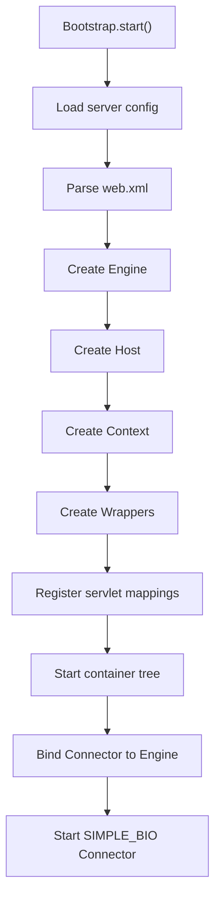
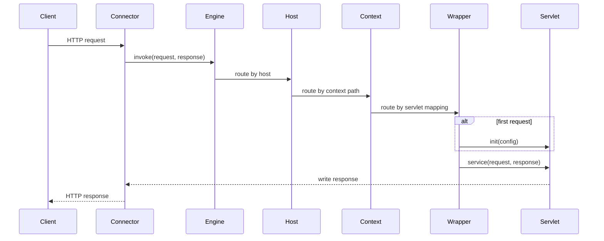
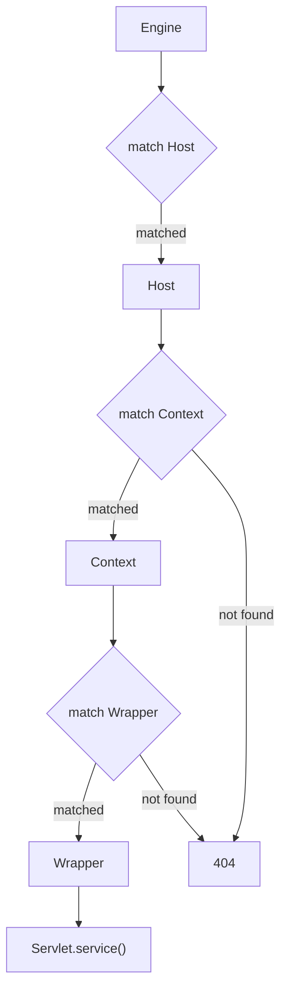

# Tomcat Phase 1: Connector 抽象与容器最小闭环

## 1. 目标与范围（必须/不做）

### 1.1 必须

- 建立 `SIMPLE_BIO` Connector 抽象，只定义接入职责，不展开网络 IO 细节实现。
- 建立 `Engine -> Host -> Context -> Wrapper` 四层容器树。
- 建立基于 `WEB_XML` 的 Servlet 注册与静态 URL 映射。
- 建立 `Servlet.init / service / destroy` 生命周期闭环。
- 建立最小 Request/Response 抽象，支撑一次同步 HTTP 请求处理。
- 建立 startup / runtime / shutdown 三段生命周期编排。

### 1.2 不做

- 不做 JSP、EL、Filter、Listener、异步请求。
- 不做 Session。
- 不做 ClassLoader 隔离。
- 不做注解部署。
- 不做完整 Pipeline/Valve 执行链，只保留接口占位与后续接入点。
- 不做热部署、管理后台、JMX、HTTP/2、TLS、复杂连接复用。

### 1.3 阶段产出

- `docs/tomcat-phase-1.md`
- `tests/acceptance-tomcat-phase-1.md`
- Phase 1 范围内的接口草图、流程图、验收标准与 Git 交付计划

### 1.4 与当前代码实现的对齐结论

- Phase 1 `MUST` 范围已落地：`SIMPLE_BIO` Connector、四层容器树、`WEB_XML` 映射、Servlet 生命周期、startup/runtime/shutdown 闭环、examples 与自动化测试。
- 当前不存在 Phase 1 `MUST` 范围内的功能缺口。
- 设计蓝图中以下抽象已按更小实现粒度收敛：
  - `deploy.UrlPattern` 未单独建模，当前实现使用 `WrapperMapping.pattern + MatchType` 表达 URL 规则。
  - `ProtocolHandler` 接口已从无参草图收敛为 `Socket` 入参版本，以匹配真实 BIO 实现。

## 2. 设计与关键决策

### 2.1 包结构（com.xujn）

```text
com.xujn.minitomcat
├── bootstrap
│   ├── Bootstrap
│   ├── Lifecycle
│   └── LifecycleState
├── connector
│   ├── Connector
│   ├── ProtocolHandler
│   ├── HttpRequest
│   ├── HttpResponse
│   └── bio
├── container
│   ├── Container
│   ├── ContainerBase
│   ├── Engine
│   ├── Host
│   ├── Context
│   ├── Wrapper
│   └── standard
├── mapper
│   ├── Mapper
│   ├── MappingResult
│   └── MappingRegistry
├── servlet
│   ├── Servlet
│   ├── ServletConfig
│   ├── ServletContext
│   └── ServletException
├── deploy
│   ├── WebXmlParser
│   ├── WebAppDefinition
│   ├── ServletDefinition
│   ├── ServerDefinition
│   └── DeploymentException
├── pipeline
│   ├── Pipeline
│   ├── Valve
│   └── ValveContext
└── support
    ├── exception
    ├── http
    └── thread
```

### 2.2 核心接口草图

#### 2.2.1 Connector

```text
interface Connector extends Lifecycle {
    void setContainer(Container container)
    Container getContainer()
    void start()
    void stop()
    void handle(HttpRequest request, HttpResponse response)
}

interface ProtocolHandler extends Lifecycle {
    HttpRequest parseRequest(Socket socket) throws IOException
    HttpResponse createResponse(Socket socket) throws IOException
}
```

#### 2.2.2 Container

```text
interface Container extends Lifecycle {
    String getName()
    Container getParent()
    void setParent(Container parent)
    void addChild(Container child)
    Container findChild(String name)
    Pipeline getPipeline()
    void invoke(HttpRequest request, HttpResponse response)
}

interface Engine extends Container {
    String getDefaultHost()
}

interface Host extends Container {
    String[] getAliases()
}

interface Context extends Container {
    String getPath()
    Mapper getMapper()
}

interface Wrapper extends Container {
    String getServletName()
    Servlet allocate()
    void deallocate(Servlet servlet)
    void invoke(HttpRequest request, HttpResponse response)
}
```

> [注释] Phase 1 仍然保留完整四层 Container 边界
> - 背景：即使当前只有单站点和单应用，Tomcat 的最小语义仍来自 Engine、Host、Context、Wrapper 的职责拆分。
> - 影响：若在 Phase 1 合并 Host 或 Wrapper，后续多虚拟主机、映射治理、生命周期管理将失去稳定扩展点。
> - 取舍：本阶段不压平容器树，只压缩每层内部能力。
> - 可选增强：Phase 2 在每层插入基础 Valve，Phase 3 在 Context 层扩展 Session 与 ClassLoader。

#### 2.2.3 Pipeline / Valve

```text
interface Pipeline {
    void addValve(Valve valve)
    Valve[] getValves()
    Valve getBasic()
    void setBasic(Valve valve)
    void invoke(HttpRequest request, HttpResponse response)
}

interface Valve {
    void invoke(HttpRequest request, HttpResponse response, ValveContext context)
}

interface ValveContext {
    void invokeNext(HttpRequest request, HttpResponse response)
}
```

Phase 1 决策：

- 接口保留。
- 默认不装配业务 Valve。
- Container 的 `invoke` 先以直接层级分发实现最小闭环。
- Phase 2 再将当前直接分发逻辑下沉到基础 Valve。

#### 2.2.4 Mapper

```text
interface Mapper {
    Host mapHost(String hostName)
    Context mapContext(Host host, String requestUri)
    Wrapper mapWrapper(Context context, String requestUri)
}
```

映射字段：

| 字段 | 类型 | 说明 |
| --- | --- | --- |
| `defaultHost` | `String` | 默认主机名。 |
| `hosts` | `Map<String, Host>` | Host 索引。 |
| `contextsByHost` | `Map<String, List<Context>>` | Host 下 Context 列表。 |
| `wrappersByContext` | `Map<String, List<WrapperMapping>>` | Context 下 Servlet 映射。 |

映射规则：

1. Host 映射优先请求头 `Host`，未命中则回退默认 Host。
2. Context 映射按最长路径前缀匹配。
3. Wrapper 映射按精确匹配 > 最长前缀匹配 > 默认匹配。
4. 同一 Context 内若相同优先级 pattern 重复，启动失败。

> [注释] URL 映射冲突在 startup 阶段终止 Context 启动
> - 背景：Phase 1 只支持静态 `web.xml` 映射，冲突在部署期即可确定。
> - 影响：若把冲突留到 runtime，404 与 500 语义都会变得不稳定。
> - 取舍：冲突定义固定为“同一 Context、同一 matchType、同一 pattern 重复注册”。
> - 可选增强：输出冲突来源、冲突 servlet 名称、部署期诊断摘要。

#### 2.2.5 Servlet

```text
interface Servlet {
    void init(ServletConfig config) throws ServletException
    void service(HttpRequest request, HttpResponse response) throws ServletException
    void destroy()
}

interface ServletConfig {
    String getServletName()
    String getInitParameter(String name)
    ServletContext getServletContext()
}

interface ServletContext {
    String getContextPath()
    Object getAttribute(String name)
    void setAttribute(String name, Object value)
}
```

#### 2.2.6 Request / Response

`HttpRequest` 字段：

| 字段 | 类型 | 说明 |
| --- | --- | --- |
| `method` | `String` | HTTP 方法。 |
| `requestUri` | `String` | 原始请求 URI。 |
| `protocol` | `String` | 协议版本。 |
| `host` | `String` | 请求 Host。 |
| `headers` | `Map<String, String>` | 请求头。 |
| `parameters` | `Map<String, List<String>>` | 查询参数。 |
| `body` | `byte[]` | 请求体。 |
| `contextPath` | `String` | 命中 Context 路径。 |
| `servletPath` | `String` | 命中 Servlet 路径。 |
| `attributes` | `Map<String, Object>` | 容器属性。 |

`HttpResponse` 字段：

| 字段 | 类型 | 说明 |
| --- | --- | --- |
| `status` | `int` | HTTP 状态码。 |
| `headers` | `Map<String, String>` | 响应头。 |
| `bodyBuffer` | `ByteArrayOutputStream` | 响应缓冲。 |
| `committed` | `boolean` | 是否已提交。 |

最小方法：

```text
void setStatus(int status)
void setHeader(String name, String value)
void write(byte[] body)
boolean isCommitted()
void flushBuffer()
void sendError(int status, String message)
```

### 2.3 当前已落地的关键类型

| 类型 | 责任 | 当前实现文件 |
| --- | --- | --- |
| `StandardServletConfig` | 将 `ServletDefinition` 转换为运行期 `ServletConfig` | `src/main/java/com/xujn/minitomcat/container/standard/StandardServletConfig.java` |
| `StandardServletContext` | 提供 Context 级属性存储 | `src/main/java/com/xujn/minitomcat/container/standard/StandardServletContext.java` |
| `DeploymentException` | 统一部署期失败表达 | `src/main/java/com/xujn/minitomcat/deploy/DeploymentException.java` |
| `RequestLine` | 承载请求行解析结果 | `src/main/java/com/xujn/minitomcat/connector/RequestLine.java` |
| `SocketProcessor` | 负责单连接请求处理 | `src/main/java/com/xujn/minitomcat/connector/bio/SocketProcessor.java` |
| `InitProbeServlet` | shutdown 未初始化 Servlet 验收探针 | `examples/phase1-basic/InitProbeServlet.java` |

### 2.4 生命周期与执行顺序

#### 2.4.1 startup

1. 读取服务器配置与 `web.xml`。
2. 创建 Engine。
3. 创建 Host 并挂到 Engine。
4. 创建 Context 并挂到 Host。
5. 创建 Wrapper，并为每个 ServletDefinition 注册唯一映射。
6. 启动容器树。
7. Connector 绑定 Engine。
8. 启动 Connector。

#### 2.4.2 runtime

1. Connector 接收 HTTP 请求。
2. ProtocolHandler 解析请求并创建 Request/Response。
3. Engine 按 Host 路由。
4. Host 按 Context 路由。
5. Context 按 URL pattern 找到 Wrapper。
6. Wrapper 初始化 Servlet。
7. Wrapper 调用 `Servlet.service`。
8. Response 刷出并返回客户端。

#### 2.4.3 shutdown

1. Connector 停止接收新请求。
2. Engine 停止并级联对子容器执行 `destroy`。
3. `Host -> Context -> Wrapper` 在父容器 stop 流程中递归释放。
4. 对每个已初始化 Servlet 调用 `destroy`。
5. 释放映射表、部署模型与线程池引用。

> [注释] 生命周期顺序固定为“先容器树、后 Connector；停机反序”
> - 背景：Connector 进入运行态之前，Host、Context、Wrapper 的映射与 Servlet 定义必须已稳定。
> - 影响：若 Connector 先启动，请求可能落入未完成注册的 Context；若 shutdown 不反序，Servlet 可能在父容器已关闭后仍被调用。
> - 取舍：Phase 1 不引入部分可用状态，组件要么启动完成，要么启动失败。
> - 可选增强：增加失败回滚、生命周期状态枚举与停机超时控制。

## 3. 流程与图

### 3.1 startup 初始化流程

图标题：Phase 1 startup 初始化流程  
覆盖范围说明：展示 `WEB_XML + SIMPLE_BIO` 条件下的容器树构建与 Connector 启动顺序。



### 3.2 请求分发最小闭环

图标题：Phase 1 请求分发最小闭环  
覆盖范围说明：展示 Connector 接入、Container 分层路由、Wrapper 调用 Servlet 的同步执行路径。



### 3.3 容器层级与路由边界

图标题：Phase 1 容器层级与路由边界  
覆盖范围说明：展示四层 Container 在最小闭环中的职责分割，不包含 Phase 2 的 Valve 链。



> [注释] 多 Context 路由必须先选 Host，再做最长 Context 匹配
> - 背景：同一路径前缀可在不同虚拟主机下重复出现，Context 路径也可形成包含关系。
> - 影响：若先做全局 Context 匹配，会破坏 Host 隔离；若不采用最长路径，会让 `/app` 吞掉 `/app/admin`。
> - 取舍：Phase 1 固定为 “Host 优先、Context 最长匹配、Wrapper 优先级匹配”。
> - 可选增强：Host alias、版本化 Context、映射命中统计。

### 3.4 已落地示例与配置

- 主示例入口：`examples.phase1basic.Phase1ExampleMain`
- 冲突校验入口：`examples.phase1basic.Phase1ConflictCheckMain`
- 部署配置：`conf/phase1-basic/server.properties`
- Servlet 映射：
  - `/demo -> DemoServlet`
  - `/error -> ErrorServlet`
  - `/partial -> PartialServlet`
  - `/init-probe -> InitProbeServlet`

## 4. 验收标准（可量化）

- 启动期必须完成一棵包含 `1 Engine + >=1 Host + >=1 Context + >=1 Wrapper` 的容器树构建。
- `WEB_XML` 中每个 `servlet-name` 都必须映射到唯一 Wrapper。
- 同一 Context 内重复 URL pattern 必须在 startup 阶段被识别并阻止启动。
- 正常请求必须经过 `Connector -> Engine -> Host -> Context -> Wrapper -> Servlet.service` 六段调用。
- 首次命中某个 Wrapper 时必须先执行一次 `init`，后续请求不得重复初始化。
- shutdown 时每个已初始化 Servlet 必须且仅执行一次 `destroy`。
- 未命中 Context 或 Wrapper 时必须返回 404。
- Servlet 抛出异常且响应未提交时必须返回 500。
- 响应已提交后再抛异常时不得覆写状态码与响应体。

### 4.1 当前实现的实际验证结果

- `mvn test` 已通过。
- `mvn -DskipTests package` 已通过。
- `Phase1ExampleMain` 可监听 `8080`。
- `/app/demo` 返回 `200` 与 `mini-tomcat demo ok`。
- `/unknown/demo` 返回 `404`。
- `/app/missing` 返回 `404`。
- `/app/error` 返回 `500`，错误消息包含 `servlet/host/context/requestUri/cause`。
- `/app/partial` 在提交响应后抛异常，原 `200` 与 `partial body` 保持不变。
- `Phase1ConflictCheckMain` 输出映射冲突并退出。
- shutdown 时已初始化 `DemoServlet` 进入 `destroy`，未访问的 `InitProbeServlet` 不进入 `destroy`。

## 5. Git 交付计划

- branch: `codex/feature/tomcat-phase-1-minimal-closure`
- PR title: `feat(tomcat-phase-1): establish connector and container minimal closure`

### commits

1. `docs(phase1): define scope and lifecycle for minimal servlet container`
   - 文件：`docs/tomcat-phase-1.md`
2. `docs(connector): add simple bio connector abstraction and request response contract`
   - 文件：`docs/tomcat-phase-1.md`
3. `feat(container): document engine host context wrapper hierarchy for phase 1`
   - 文件：`docs/tomcat-phase-1.md`
4. `docs(mapper): define host context wrapper mapping rules and startup conflict handling`
   - 文件：`docs/tomcat-phase-1.md`
5. `docs(servlet): define wrapper managed servlet lifecycle contract`
   - 文件：`docs/tomcat-phase-1.md`
6. `docs(flow): add startup and runtime mermaid diagrams for phase 1`
   - 文件：`docs/tomcat-phase-1.md`
7. `test(acceptance): add normal path acceptance cases for connector and mapping`
   - 文件：`tests/acceptance-tomcat-phase-1.md`
8. `test(errors): add 404 500 conflict and committed response scenarios`
   - 文件：`tests/acceptance-tomcat-phase-1.md`
9. `docs(git): define branch pr and commit policy for phase 1 delivery`
   - 文件：`docs/tomcat-phase-1.md`
